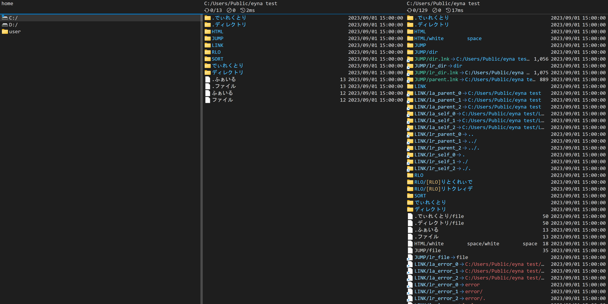
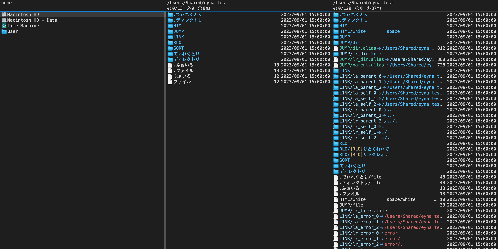

# eyna

Electron 製のキーボードファイラーです。  
Windows と Mac で同じファイラーを使いたかったので作りました。

ファイル操作には nodejs の fs を使用せず C++ addons で実装しています。

多画面なので、操作に多少クセがあります。

操作方法は [config/key.json](config/key.json) から雰囲気で・・

## できること

- ファイル操作
- 正規表現による再帰検索
- ビューア
  - 画像 (gif / jpg / jpeg / png / webp)
  - 音声 (mp3 / m4a / ogg / wav / wave)
  - 動画 (mp4 / webm)
  - テキスト
  - バイナリ
  - diff
  - PDF
- リンク 解決
  - シンボリックリンク
  - ショートカット (Windows)
  - エイリアス (Mac)
- クラウドファイル 判定
  - FILE_ATTRIBUTE_RECALL_ON_DATA_ACCESS (Windows)
  - NSURLUbiquitousItemDownloadingStatusNotDownloaded (Mac)
- Unicode制御文字 対策 (LRO / RLO)

## スクリーンショット

### Windows

### Mac

## 注意事項

ファイル操作を行う都合上、アンチウィルスソフトウェアによっては誤検知される可能性があります。
基本的には問題ないはずですが、不安な場合はは使用しないことをおすすめします。

Apple Silicon 環境で起動するには、`xattr` コマンドを使用して Apple Gate Keeper の対象外に設定する必要があります。
