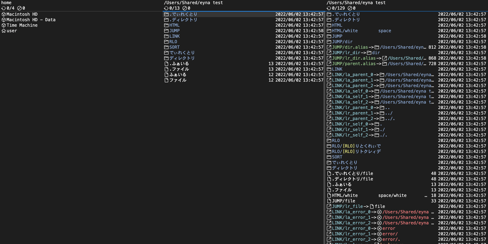

Electron 製のキーボードファイラー  
Windows と Mac で同じファイラーを使いたかったので作りました

ファイル操作には nodejs の fs を使用せず C++ addons で実装

多画面なので操作に多少クセがあります

操作方法は [config/key.json](config/key.json) から雰囲気で・・

できること

- ファイル操作
- 正規表現による再帰検索
- イメージビューア
- テキストビューア
  - Monaco Editor
- リンク 解決
  - シンボリックリンク
  - ショートカット(Windows)
  - エイリアス(Mac)
- RLO 対策

